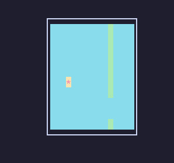

# Flappy

> Flappy Bird clone in Ncurses

### TODO

- [ ] Add tests

## DEPS

* `make`, `ncurses`
* By default, the project is compiled with `clang++` but you can use `g++`

## INSTALLATION AND RUNNING

* You can build the project with `make`, and run it with `./binary` 
